 
## 查看主页获取源码

> **作者介绍**： **✌**全网粉丝10W+本平台特邀作者、博客专家、CSDN新星计划导师、java领域优质创作者,博客之星、掘金/华为云/阿里云/InfoQ等平台优质作者、专注于项目实战 **✌**

  

### 一、作品包含

源码+数据库+设计文档万字+PPT+全套环境和工具资源+部署教程

### 二、项目技术

前端技术：Html、Css、Js、Vue、Element-ui

数据库：MySQL

后端技术：Java、Spring Boot、MyBatis

  

### 三、运行环境

开发工具：IDEA/eclipse + 微信开发者工具

数据库：MySQL5.7

数据库管理工具：Navicat10以上版本

环境配置软件： JDK1.8+Maven3.6.3

前端Nodejs：14

### 四、项目介绍
项目编号：mpweixinA026

高校社团管理微信小程序是一款专为大学生社团活动设计的便捷管理工具，它集成了社团信息发布、活动组织、成员管理等功能，旨在简化社团运营流程，提升校园文化生活品质。通过这款小程序，社团成员可以轻松加入社团、参与活动报名、查看社团动态，而社团负责人则可以高效地进行成员招募、活动策划与通知发布，有效促进了校园社团的活跃度和凝聚力，为高校学生提供了一个展示自我、交流学习的平台。

前台分为社团信息和用户
用户功能：首页、社团信息、社团活动、我的。
社团信息功能：首页、社团信息、社团活动和我的。

后台管理员的功能：首页、个人中心、用户管理、社团类型管理、社团信息管理、申请入社管理、活动类型管理、社团活动管理、参加活动管理、创建社团管理、社团公告管理和系统管理。

### 五、运行截图

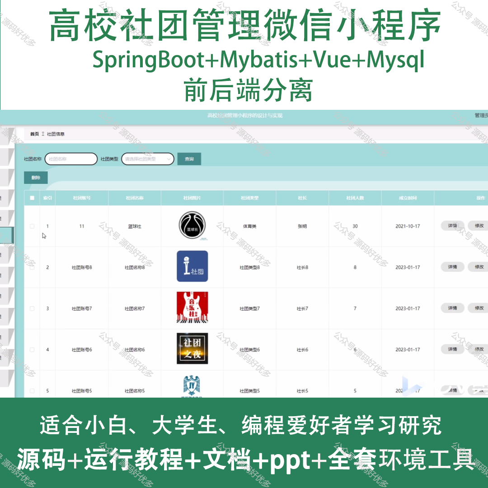
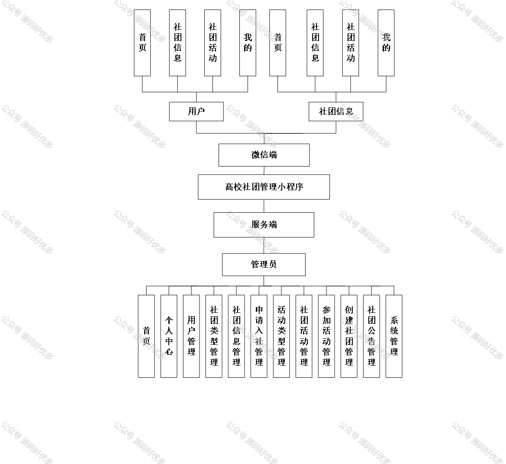
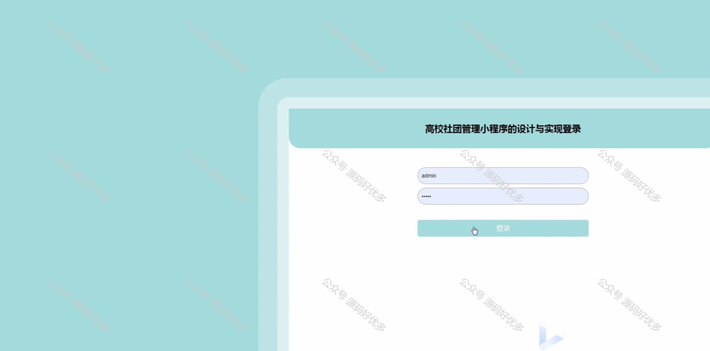
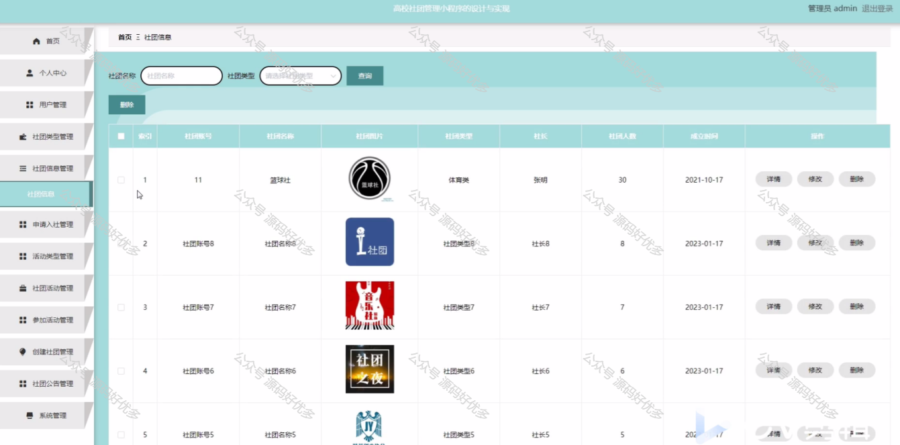
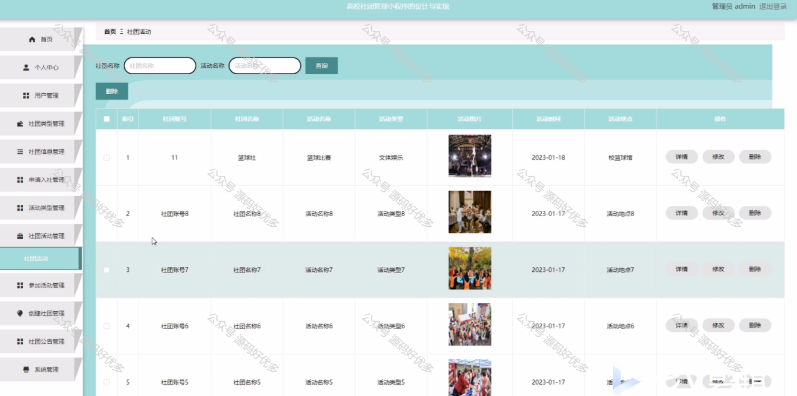
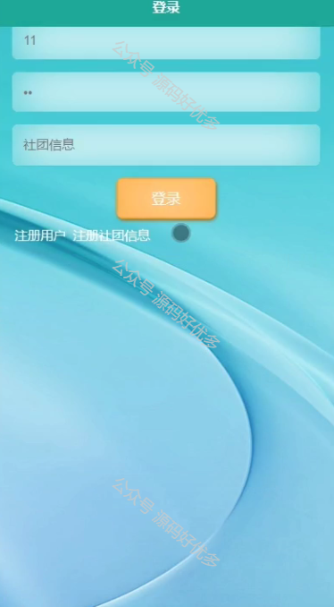
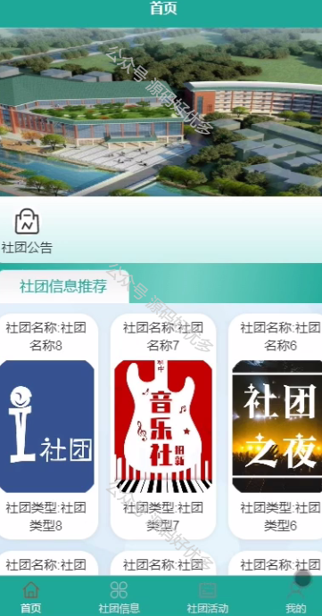
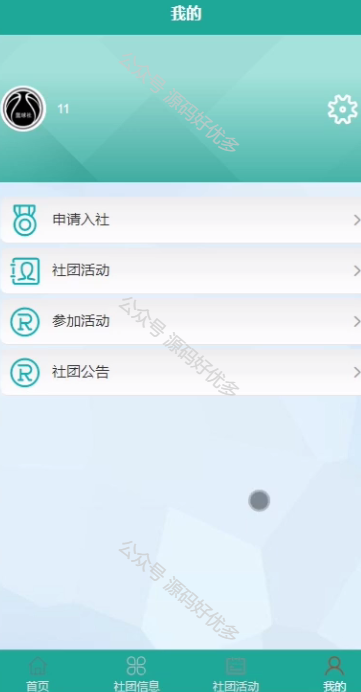
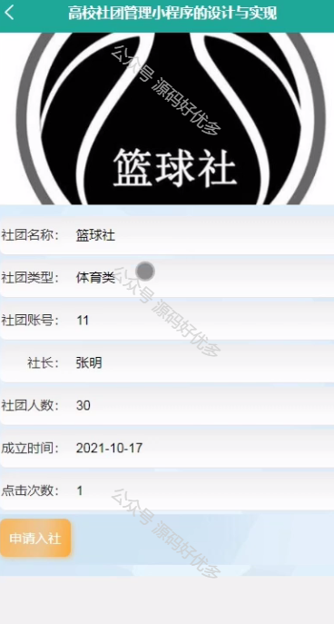
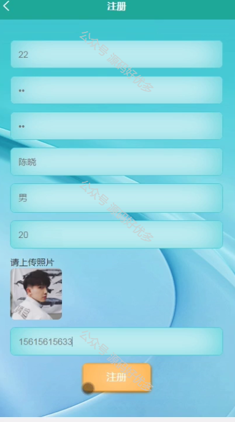
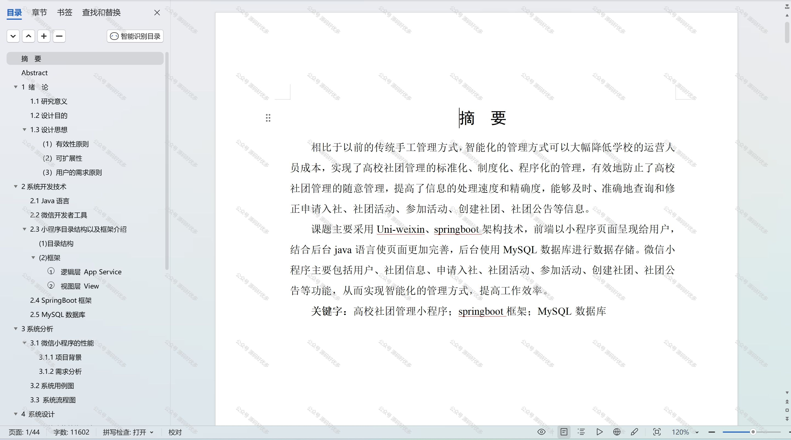

  
